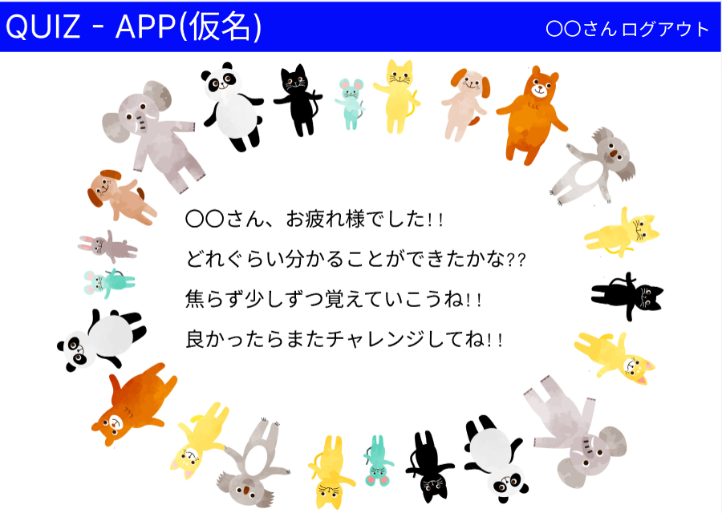

■サービス概要

1~10問までの簡単な質問に答え、どの程度の内容まで理解できるか確認するクイズ形式のアプリです。
正解の場合は次の質問へ進むことができ、間違った場合は今やった質問がそのまま表示されます。
当アプリにはユーザー登録機能及び認証機能を実装したいと考えています。

■ このサービスへの思い・作りたい理由

私には現在、4歳の息子と2歳の娘がいますが、息子が以前に言葉の発達が遅れていると指摘を受けた為、
療育サービスを受けさせる決心をし、その手続きの一環で息子が3歳になったタイミングで発達検査を受けたのですが、
その際に受けたテストからインスピレーションを受け、自分の子供達にこのアプリを開発したいと考えるに至りました。

最終的には他の子供達にもアプリを利用してもらい、保護者様方が自分達の子供達がどの程度の内容を理解できるように
なっているのか知ることができ、子供達と保護者の皆様双方が楽しく使用できるアプリになればと考えています。

※発達検査を再現したアプリではございません。あくまでお子さん達向けのクイズ形式のアプリです。

■ ユーザー層について

子供達(質問を答える側)及び保護者の皆様(回答結果を確認する側)

■サービスの利用イメージ

計10問の簡単なクイズに対して子供達に回答してもらうクイズ形式のアプリです。
アプリにはユーザー登録機能及び認証機能を設ける予定です。
アプリの利用形式は以下の通りです。

1.ログイン前のトップ画面上部の「ユーザー登録」よりユーザー名、メールアドレス、パスワード、パスワード確認を入力し、登録
2.ログイン前のトップ画面上部の「ログイン」よりメールアドレス、パスワードを入力し、ログイン
3.ログイン後のトップ画面中央に表示の「START」ボタンを押し、クイズを開始
4.下記のようなクイズに10問回答
1-4.png)
※正しい回答を選択した場合は以下のように次の質問へ移行
2.png)
※間違った回答を選択した場合は以下のように同じ質問を表示
3.png)
5.10問終了した後、以下の画面を表示

■ ユーザーの獲得について

今、息子が通っている療育施設の先生方に自分が作成したアプリのことをお話してみようと考えています。

■ サービスの差別化ポイント・推しポイント

アプリの内容自体はありふれたクイズ形式のアプリだと思いますが、作成するに至った経緯は
「ただ単に思いついたから作成した」というような単純な理由ではなく、「自分の子供達はもちろん
他の子供達や保護者の皆様にもアプリを通して笑顔になってもらいたい」という理由がありますので、
その部分を差別化ポイントとしたいです。

■ 機能候補

アプリにはユーザー登録機能及び認証機能を設ける為、その部分でCRUD機能を実装したいと考えています。
また、計10問の質問は各質問ごとに1ページずつ質問を設け、その都度正解or不正解を見極める機能を
実装したいと考えています。

■ 機能の実装方針予定

ユーザー登録機能を実装する為、Gemの一つであるdevise機能を実装したいと考えています。